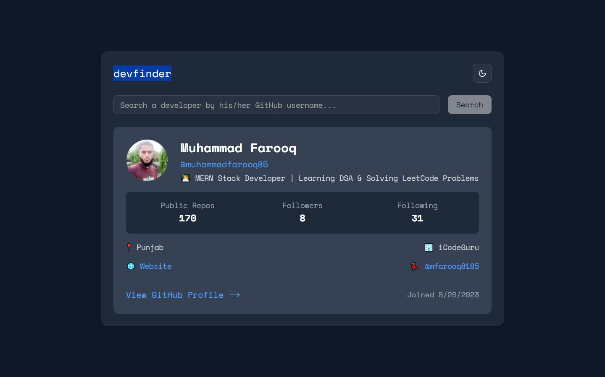

# GitHub Developer Finder

## A responsive web application built with Next.js and ShadCN UI to search and explore GitHub developer profiles in real time. This app fetches developer data via the GitHub API, providing an easy-to-use interface for discovering users, viewing their repositories, and examining their GitHub stats.

### 🔗 Live Demo: https://github-devv-finder.vercel.app

## ✨ Features

### Real-time GitHub profile search – search and display GitHub user profiles instantly.

### Display user stats – show relevant stats like repositories, followers, and following.

### Modern and responsive UI – created with ShadCN UI for a sleek, user-friendly experience.

## 🛠️ Technologies Used

### Next.js – the React-based framework for building fast, scalable web apps.

### ShadCN UI – for creating the beautiful and responsive UI components.

### GitHub API – fetches user data and repositories in real-time.

### CSS – for custom styling and UI enhancements.

## Screenshot



## 📖 Getting Started

#### To get this project up and running locally, follow these steps:

### 1) Clone the repo:

```
git clone https://github.com/your-username/github-dev-finder.git
```

### 2) Install the dependencies:

```
npm install
# or
yarn install
# or
pnpm install

```

### 3) Run the development server::

```
npm run dev
# or
yarn dev
# or
pnpm dev
```

### 1) Open http://localhost:3000 in your browser to see the result.

### Learn More

#### To learn more about Next.js, take a look at the following resources:

#### Next.js Documentation – learn about Next.js features and API.

#### Learn Next.js – an interactive Next.js tutorial.

### Deploy on Vercel

#### The easiest way to deploy your Next.js app is to use the Vercel Platform from the creators of Next.js.
